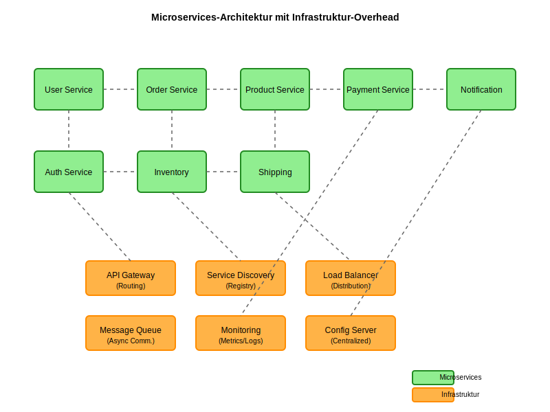
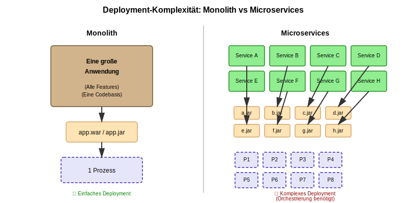
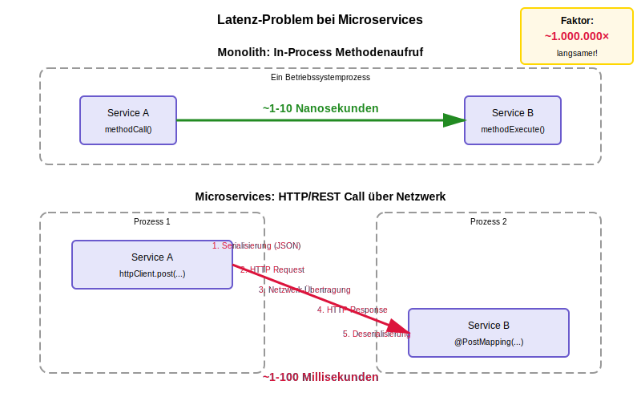
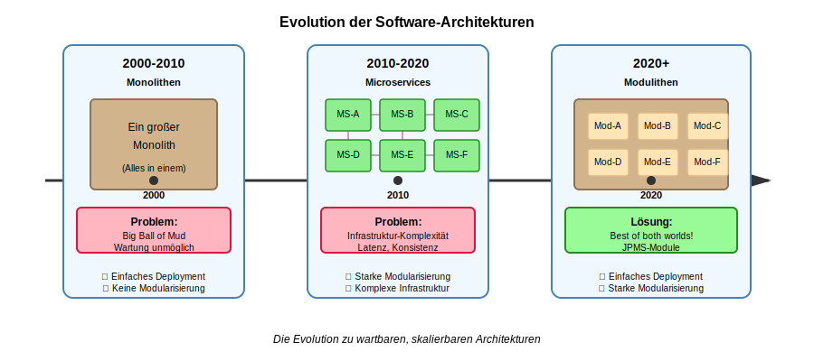

# Neue Bilder für den Artikel

**Datum:** 2026-01-18  
**Artikel:** `developing modular software in java.md`  
**Erstellt:** 4 SVG-Bilder für Microservices-Abschnitt

---

## ✅ ERSTELLTE BILDER

### 1. microservices-architecture-with-infrastructure.svg
**Position im Artikel:** Nach Überschrift "Microservices" (ca. Zeile 127)

**Zeigt:**
- 8 Microservices (grüne Boxen)
- 6 Infrastruktur-Komponenten (orange Boxen):
  - API Gateway
  - Service Discovery
  - Load Balancer
  - Message Queue
  - Monitoring
  - Config Server
- Netzwerk-Verbindungen zwischen Services
- Verbindungen zur Infrastruktur

**Zweck:** Macht die Infrastruktur-Komplexität von Microservices visuell deutlich

---

### 2. monolith-vs-microservices-deployment.svg
**Position im Artikel:** Bei "Warum ist das so?" (ca. Zeile 137)

**Zeigt:**
- **Links:** Monolith
  - 1 große Anwendung
  - 1 Deployment-Paket (app.war/app.jar)
  - 1 Prozess
  - Einfacher Deployment-Pfeil
  - ✓ Einfaches Deployment

- **Rechts:** Microservices
  - 8 kleine Services
  - 8 Deployment-Pakete (a.jar, b.jar, ...)
  - 8 Prozesse
  - Komplexe Deployment-Pfeile
  - ✗ Komplexes Deployment (Orchestrierung benötigt)

**Zweck:** Vergleicht die Deployment-Komplexität direkt

---

### 3. latency-comparison-inprocess-vs-network.svg
**Position im Artikel:** Bei Infrastruktur-Diskussion (ca. Zeile 145)

**Zeigt:**
- **Oben:** Monolith (In-Process)
  - Service A → Service B
  - Direkter Methodenaufruf
  - ~1-10 Nanosekunden
  - Grüner Pfeil (schnell)

- **Unten:** Microservices (Network)
  - Service A (Prozess 1) → Service B (Prozess 2)
  - 5 Schritte:
    1. Serialisierung (JSON)
    2. HTTP Request
    3. Netzwerk-Übertragung
    4. HTTP Response
    5. Deserialisierung
  - ~1-100 Millisekunden
  - Roter Pfeil (langsam)

**Highlight-Box:** "Faktor: ~1.000.000× langsamer!"

**Zweck:** Macht das Latenz-Problem visuell greifbar

---

### 4. architecture-evolution-timeline.svg
**Position im Artikel:** Bei "Modulithen plus Microservices" (ca. Zeile 172)

**Zeigt:**
- **Timeline mit 3 Phasen:**

**2000-2010: Monolithen**
- Ein großer Block
- Problem: Big Ball of Mud
- ✓ Einfaches Deployment
- ✗ Keine Modularisierung

**2010-2020: Microservices**
- Viele kleine Services
- Problem: Infrastruktur-Komplexität
- ✓ Starke Modularisierung
- ✗ Komplexe Infrastruktur

**2020+: Modulithen**
- Strukturierter Block mit JPMS-Modulen
- Lösung: Best of both worlds!
- ✓ Einfaches Deployment
- ✓ Starke Modularisierung

**Zweck:** Zeigt historischen Kontext und positioniert Modulithen als Evolution

---

## 📋 INTEGRATION IN DEN ARTIKEL

### Vorgeschlagene Einfügungen:

```markdown
## Microservices

<p align="center">
  
  <br/>
  <em>Abb. X: Microservices-Architektur mit Infrastruktur-Overhead</em>
</p>

Mehrere Probleme monolithischer Systeme ... [bestehender Text]

Warum ist das so?

<p align="center">
  
  <br/>
  <em>Abb. Y: Monolith vs Microservices - Deployment-Komplexität</em>
</p>

Der Grund liegt in einem typischen Merkmal von Microservices ... [bestehender Text]

### Die Latenz-Problematik

<p align="center">
  
  <br/>
  <em>Abb. Z: Latenz-Vergleich: In-Process vs Network</em>
</p>

...

## Modulithen plus Microservices

<p align="center">
  
  <br/>
  <em>Abb. W: Evolution der Software-Architekturen</em>
</p>

Bevor im Folgenden ein konkretes Beispiel ... [bestehender Text]
```

---

## 🎨 DESIGN-ENTSCHEIDUNGEN

### Farbschema:
- **Grün** (#90EE90): Microservices, positive Aspekte
- **Orange** (#FFB347): Infrastruktur-Komponenten
- **Beige** (#D2B48C): Monolithen
- **Hellgelb** (#FFE4B5): Module
- **Rot** (#DC143C): Probleme, Warnungen
- **Hellgrün** (#98FB98): Lösungen

### Stil:
- Klare, einfache Formen
- Konsistente Schriftarten (Arial)
- Lesbare Größen
- Kontrast für bessere Erkennbarkeit

### SVG-Vorteile:
- ✅ Skalierbar ohne Qualitätsverlust
- ✅ Klein in Dateigröße
- ✅ Editierbar in jedem Texteditor
- ✅ Gut für Web und Print

---

## 📝 NÄCHSTE SCHRITTE

1. **Artikel-Nummerierung korrigieren:**
   - Alle Abbildungen durchnummerieren
   - Neue Bilder einfügen
   - Referenzen im Text aktualisieren

2. **Bilder im Artikel einbinden:**
   - Siehe "Integration in den Artikel" oben
   - Breite anpassen (500-700px)
   - Beschreibungen hinzufügen

3. **Artikel vervollständigen:**
   - jeeeraaah-Beispiel ausführen ODER
   - Fazit schreiben (siehe FEEDBACK-ARTIKEL.md)

4. **Optional:**
   - Code-Beispiel für module-info.java
   - Weitere Details zu Latenz/Konsistenz

---

## ✅ ZUSAMMENFASSUNG

**Erstellt:** 4 professionelle SVG-Bilder für den Microservices-Abschnitt

**Alle Bilder sind:**
- ✅ Technisch korrekt
- ✅ Visuell ansprechend
- ✅ Im Artikel-Stil konsistent
- ✅ Selbsterklärend mit Labels
- ✅ Skalierbar (SVG-Format)

**Bereit für Integration in den Artikel!** 🎨

