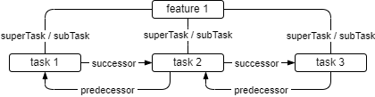
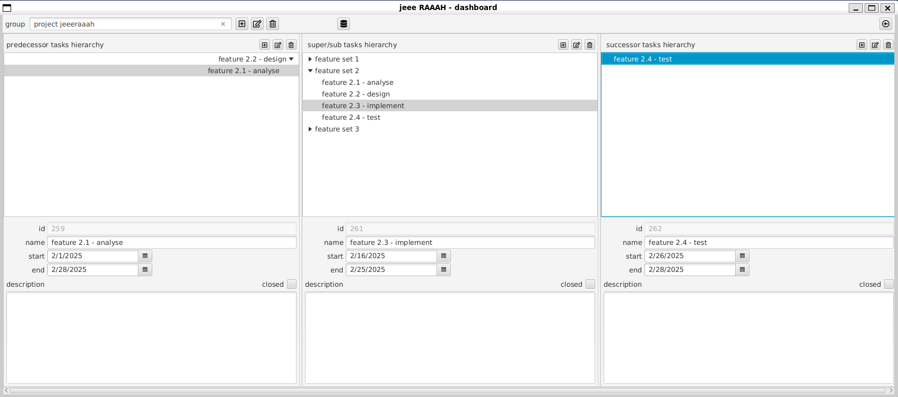
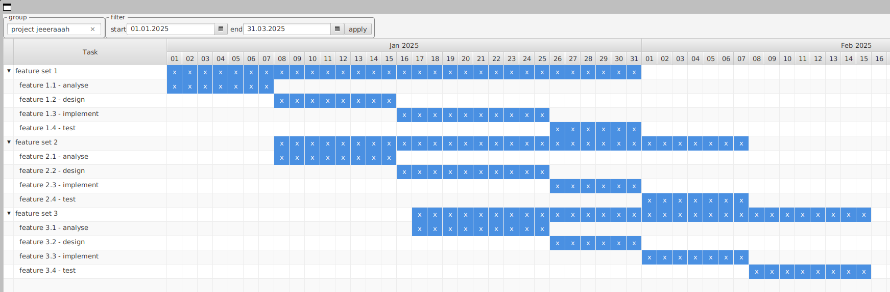

# JPMS in Aktion - jeeeraaah

JPMS (Java Platform Module System) ist eine Technologie zur Modularisierung von Java Anwendungen. Es wurde 2017 mit der Java Version 9 veröffentlicht.

Für das JDK selbst wird JPMS meist als großer Erfolg gewertet, da es seit dem nicht mehr als ein einziger riesiger Monolith (rt.jar) ausgeliefert werden muss, der schon aufgrund seiner Größe nicht mehr zum sich immer weiter verbreitenden Architekturmodell Microservices passte.

In der Java User Community hingegen kämpft JPMS aus verschiedenen Gründen weiter um Akzeptanz:

- Der oft nicht zu vermeidende Einsatz von (noch) nicht modularem legacy code erschwert den Einsatz von JPMS (Stichwort "split packages"). Der Nutzen ist dann ohnehin einschränkt: nicht modularer code "landet" in "automatic modules", die zwar auch Module heißen, aber nicht die Vorteile von JPMS Modulen mit sich bringen (dazu später mehr).
- Probleme mit reflection, die mit JPMS gesondert behandelt werden muss.
- Für die effektive Nutzung der JPMS features muss auch eine gewisse Lernkurve in Kauf genommen werden.

Modularisierung ist aber ein entscheidender Faktor für die Entwicklung von gut wartbaren, gut verständlichen und gut erweiterbaren, großen Softwaresystemen (siehe den Beitrag [modular software in java](../modular-software-in-java/modular-software-in-java.md)).

[Das Projekt jeeeraaah](https://github.com/r-uu/main/tree/main/root/app/jeeeraaah) wurde als "proof of concept" (POC) für die Möglichkeit der Verwendung von JPMS in Enterprise Java Systemen gestartet. Ziel ist, anhand einer überschaubaren, aber nicht trivialen Anwendung zu überprüfen, ob und wie Modularisierung großer Java Applikationen mit JPMS eine valide Alternative zu anderen Architekturansätzen wie z. B. Microservices ist.

Gleichzeitig soll kritisch geprüft werden, ob die Vorteile von Modularisierung mit JPMS die Nachteile überwiegen, z. B. die Komplexität der Modularisierung selbst, die Komplexität der Build- und Deployment-Prozesse, ... .

Fachlich geht es im Projekt jeeeraaah im Kern um die Verwaltung von Aufgaben (Tasks) und die Planung von Arbeitsabläufen. Dazu sollen zusammengehörige Tasks in Gruppen (TaskGroups) organisiert werden. **Abb. 1** zeigt das zentrale Objektmodell:

<p align="center">
  
  <br/>
  <em>Abb. 1: UML - TaskGroup-Task</em>
</p>

Die Idee ist, Aufgaben in Teilaufgaben zu gliedern (Tasks und SubTasks) und für alle Aufgaben Abläufe (Predecessor- und Successor-Tasks) planen zu können.

<p align="center">
  
  <br/>
  <em>Abb. 2: Task-Objekte</em>
</p>

In der Anwendung sieht das dann im dashboard etwa so aus:

<p align="center">
  
  <br/>
  <em>Abb. 3: jeeeraaah dashboard</em>
</p>

Eine Gantt-Diagramm-Darstellung zeigt eine andere Sicht auf Aufgaben und die geplanten Abläufe:

<p align="center">
  
  <br/>
  <em>Abb. 4: jeeeraaah Gantt Diagramm</em>
</p>

## Der Technologiestack

Ein Ziel des POCs ist, die Versionen der eingesetzten Technologien dauerhaft auf einem möglichst modernen Stand zu halten. Updates aller Technologien gehören daher zur Tagesordnung.

Jeeeraaah ist eine client-server Java Anwendung, deren Bestandteile (bis auf eine Ausnahme, dazu später mehr) mit Java 25 entwickelt wurden. Dabei kommen aktuell folgende Technologien zum Einsatz:

Das Backend ist eine Jakarta EE 10 / Microprofile 6.1 Anwendung. Als Application Server wird Open Liberty verwendet. Im Frontend kommt JavaFX 25 zum Einsatz.

Frontend und Backend sind weitestgehend mit JPMS modularisiert. Die Kommunikation zwischen ihnen erfolgt über REST APIs, die mit Jakarta-RS implementiert wurden. Die (De-) Serialisierung der Daten erfolgt mit Jackson, was einen komfortablen und gleichzeitig effizienten Umgang auch mit zirkulären Datenstrukturen (siehe Task/TaskGroup Objektmodell) erlaubt. Die build Prozesse für beide Anwendungen werden mit Apache Maven realisiert.

Für das Identity and Access Management (IAM) wird Keycloak verwendet. Das frontend kommuniziert direkt mit Keycloak, um die Authentifizierung der Benutzer durchführen zu lassen. Das Open Liberty backend ist so konfiguriert, dass es die von keycloak ausgestellten Token akzeptiert und die Autorisierung für alle eingehenden Requests durchführen kann.

Die persistente Datenhaltung im Backend wird mit einer postgres Datenbank realisiert. Sie wird genau wie keycloak in einem von docker-compose orchestrierten Container betrieben. In diesem POC liegen die jeeeraaah- zusammen mit den keycloak-Daten in ein und derselben Datenbank, sie sind aber jeweils explizit einem eigenen Schema zugeordnet. Die jeeeraaah Zugriffe auf die Datenbank sind durchgängig mit JPA (hibernate) umgesetzt.

## Die Modulstruktur

```
jeeeraaah/
├── backend/                    # Server-Komponenten
│   ├── api/ws_rs/              # REST API Server (Open Liberty)
│   ├── persistence/            # JPA Entities & Repositories
│   └── common/                 # gemeinsame Backend-Klassen, Mappings DTO <-> JPA
├── frontend/                   # Client-Komponenten
│   ├── api.client/ws_rs/       # REST API Client
│   ├── ui/fx/                  # JavaFX UI
│   └── common/                 # gemeinsame Frontend-Klassen, Mappings DTO <-> Bean <-> JavaFXBean
└── common/api/                 # API Domain Model Types (geteilt)
```

Bis auf das maven Modul r-uu.app.jeeeraaah.backend.api.ws_rs sind alle Module mit JPMS modularisiert. Warum das Modul r-uu.app.jeeeraaah.backend.api eine Ausnahme ist, wird in [module backend](#modul-backend) beschrieben.

## Architektur

Das Backend ist in zwei maven Hauptmodule aufgeteilt: api und persistence. Das api Modul enthält die REST API Schnittstellen, die mit Jakarta-RS implementiert wurden. Im persistence Modul befindet sich die Datenzugriffsschicht, die mit JPA (hibernate) implementiert wurde.

Das frontend ist ebenfalls in zwei maven Module aufgeteilt: ui und api.client. Das ui Modul enthält die JavaFX Komponenten, die für die Darstellung der Benutzeroberfläche verantwortlich sind. Das api.client Modul enthält die Logik für die Kommunikation mit dem backend über REST APIs.

Das Bindeglied zwischen frontend und backend ist das maven Modul common, das Objekte und Objekt-Mappings enthält, die von beiden Seiten verwendet werden.

### Modul common

Das `common.api.domain` maven Modul enthält zentrale Schnittstellen und Basisklassen des Domänenmodells. Dieses Modul bildet das Fundament für das jeeeraaah Task-Management-System und definiert:

- Zentrale Domain-Entitäten und deren Verträge
- **Lazy-Loading-Varianten** zur Performanceoptimierung (domain.lazy package)
- **Flache Repräsentationen** für vereinfachten Datentransfer `domain.flat package)
- Konfigurationen für Beziehungen zwischen Tasks

Das Modul ist so konzipiert, dass es als Bindeglied zwischen Frontend und Backend fungiert, um ein konsistentes Domänenmodell über alle Anwendungsschichten hinweg zu gewährleisten.

Der Aufbau des Moduls spiegelt die Struktur des gesamten Projekts wider:

- das Submodul **...common.api.domain** enthält vor allem die zentralen Interfaces des Domänenmodells, die von beiden Seiten (Frontend und Backend) verwendet werden. Um die Verwendung der Interfaces auf beiden Seiten möglichst konsistent halten zu können, sind sie generisch, was eine starke Typisierung in den implementierenden Klassen ermöglicht.

- das Submodul **...common.api.domain.flat** enthält "flache" Repräsentationen von Domain-Objekten, die nur Kern-Felder ohne teure Beziehungen enthalten.

- das Submodul **...common.api.domain.lazy** enthält Lazy-Loading-Varianten, die IDs anstelle von vollständigen Objekten verwenden. Dies ermöglicht verzögertes Laden von Beziehungen und reduziert die Netzwerk- und Speicherlast. Lazy Typen sind für Performance-optimierte Szenarien gedacht, z.B. beim Aufbau von Hierarchien im Gantt-Diagramm.

- das Submodul **...common.api.ws.rs** enthält die DTO Klassen, mit deren Hilfe frontend und backend kommunizieren. Die DTO Klassen implementieren die generischen Interfaces aus common.api.domain.

- das Submodul **...common.api.bean** enthält (Java-)Bean-Implementierungen der Interfaces aus common.api.domain. Genaugenommen sind die Implementierungen keine Java-Beans, da sie fluent accessors anstelle der Java-Beans üblichen get-/set-accessors verwenden. Die Bean-Implementierungen aus diesem Modul sind für die Realisierung von Geschäftslogik im Projekt vorgesehen.

Ergänzend zu den Submodulen enthält das common Modul noch das Submodul **common.api.mapping**, in dem die Mappings zwischen Java-Beans und DTOs definiert werden. Die Mappings werden aktuell mit MapStruct implementiert.

---

<details><summary>Hinweis 1: möglicher Verzicht auf DTOs</summary>
Es ist durchaus denkbar, dass die Bean-Implementierungen aus common.api.bean auch für die Realisierung von DTOs verwendet werden könnten. In diesem Fall könnte das common.api.ws.rs Submodul entfallen. Aktuell ist es aber so, dass die DTOs und die Bean-Implementierungen getrennt sind, um eine klare Trennung zwischen den beiden Schichten zu gewährleisten.
</details>

---

<details><summary>Hinweis 2: möglicher Verzicht auf MapStruct</summary>
Die MapStruct Mappings implementieren die Umwandlung aktuell quasi "manuell", d. h. die typischen MapStruct Features wie automatisches Mapping von gleichnamigen Feldern oder die Verwendung von Mapping-Methoden für die Umwandlung von komplexeren Objekten werden nicht bzw. nur sehr eingeschränkt genutzt. Das hat sich im Laufe der Zeit in diese Richtung entwickelt.

Im Nachhinein wäre ein Verzicht auf MapStruct und die Implementierung der Mappings von Hand wahrscheinlich die bessere Wahl gewesen, da die Verwendung von MapStruct hier mehr Komplexität z. B. im Build-Prozess mit sich bringt und die typischen Vorteile von MapStruct durch automatisierte Code-Generierung für die Umwandlung nicht zum Tragen kommt. Die aktuelle Implementierung funktioniert allerdings, ist gut getestet und es ist durchaus denkbar, dass durch zukünftige Erweiterung des Objektmodells die typischen Vorteile von Mapstruct zum Tragen kommen. 
</details>

---

### Modul backend

Das backend maven Modul besteht wieder aus zwei Hauptmodulen: api.ws_rs und persistence.

Das api.ws_rs Modul enthält die REST API Schnittstellen, die mit Jakarta-RS implementiert wurden. Es ist das einzige maven Modul im Projekt jeeeraaah, das nicht mit JPMS implementiert wurde.

Der Grund hierfür liegt in der WAR Deployment Architektur, die Standard für Jakarta EE Application Server wie Open Liberty ist. Jakarta EE Application Server deployen WAR-Dateien standardmäßig auf dem `classpath`. Theoretisch ließe sich das WAR auch mit JPMS bauen und auf dem `modulepath` deployen. Die Jakarta EE Server APIs, mit denen das WAR interagiert, sind aber selbst nicht JPMS konform, was dazu führt, dass die JPMS Kapselungsmechanismen nicht greifen würden. Da JPMS in diesem Kontext also keine signifikanten Vorteile bringen würde, wurde auf die in diesem Fall entstehende zusätzlische Komplexität für das Deployment des Moduls mit JPMS verzichtet.

Im `persistence` maven Modul befindet sich die mit JPA (hibernate) implementierte Datenzugriffsschicht. Auch hier gibt es ein `common` Modul, das die Mappings zwischen JPA-Entity-Typen und Jakarta-WS-RS-DTOs definiert.

### Modul frontend

Das `frontend` ist ebenfalls in zwei maven Module aufgeteilt: `ui` und `api.client`. Das `ui` Modul enthält die JavaFX Komponenten, die für die Darstellung der Benutzeroberfläche verantwortlich sind. Das `api.client` Modul enthält die Logik für die Kommunikation mit dem backend über REST APIs. Auch hier gibt es ein `common` Modul, das die Mappings zwischen JavaFX-Objekten und Jakarta-RS-DTOs definiert.

## Konkrete Vorteile von JPMS im Projekt jeeeraaah

### Quantitative Kapselungsmetriken für App-Module (Stand: 28. Februar 2026)

Die **jeeeraaah-Anwendung** besteht aus **10 JPMS-Modulen**, die zusammen **24 Packages exportieren** (drastisch reduziert von vorher 46 Packages). Von insgesamt **149 public Typen** (Klassen, Interfaces, Enums, Records) sind:

- **69 Typen (46.3%)** in exportierten Packages → Teil der öffentlichen API
- **80 Typen (53.7%)** in nicht-exportierten Packages → **durch JPMS vor externem Zugriff geschützt**

Diese **Kapselungsrate von 53.7%** zeigt den konsequenten Einsatz von JPMS zur Kapselung von Implementierungsdetails. Über die Hälfte aller public Typen bleibt verborgen und ist nur intern verfügbar.

**Verbesserung gegenüber vorherigem Stand:**
- Vorher: 7.3% Kapselung (14 von 191 Typen versteckt, 46 exportierte Packages)
- Nachher: **53.7% Kapselung (80 von 149 Typen versteckt, 24 exportierte Packages)**
- **Steigerung: +46.4 Prozentpunkte** durch systematische Bereinigung:
  - **JPAFactory entfernt**: War nur Test-Utility ohne produktiven Nutzen
  - **frontend.ui.fx drastisch reduziert**: 24 Packages → 1 Package exportiert (23 Packages intern)
  - **72 UI-Implementierungstypen versteckt**: Controller, Views, Utils vollständig gekapselt

#### App-Module mit versteckten Implementierungsklassen

**frontend.ui.fx** – 72 versteckte public Klassen (größte Verbesserung! 🎯)
- **Dramatische Reduzierung**: Nur noch 1 Package exportiert (vorher 24 Packages!)
- Einziger Export: `de.ruu.app.jeeeraaah.frontend.ui.fx` (für MainAppRunner - Classpath-Zugriff)
- **23 Subpackages NICHT exportiert** (alle waren vorher exportiert):
  - `auth`, `dash`, `task`, `task.edit`, `task.gantt`, `task.selector`, `task.view.*`, `taskgroup.*`, `test`, `util`
- **72 UI-Implementierungstypen versteckt**: Controller, Views, interne Helfer vollständig gekapselt
- **Wichtige Korrektur**: Der frühere Kommentar "Export for CDI and JavaFX" war falsch
  - Frameworks brauchen `opens`, nicht `exports`!
  - CDI/JavaFX Reflection wird über `opens`-Direktiven ermöglicht (25 Packages geöffnet, aber nicht exportiert)
- **Vorteil:** Massive Kapselungsverbesserung ohne Funktionsverlust - UI-Implementierung bleibt vollständig intern
- **Lerneffekt**: Der größte Kapselungsfehler war die Verwechslung von `exports` (compile-time API) und `opens` (runtime reflection)

**backend.persistence.jpa** – 10 versteckte public Klassen  
- Package `de.ruu.app.jeeeraaah.backend.persistence.jpa.entity` mit 2 JPA-Entities
  - `TaskJPA`, `TaskGroupJPA`
  - **Qualified Export**: nur zugänglich für `backend.common.mapping.jpa.dto` und `backend.api.ws.rs`
  - Nicht frei importierbar, strengere Kapselung als public export
- Package `de.ruu.app.jeeeraaah.backend.persistence.jpa.ee` mit 4 CDI-Bean-Implementierungen
  - `TaskServiceJPAEE`, `TaskGroupServiceJPAEE`, `TaskRepositoryJPAEE`, `TaskGroupRepositoryJPAEE`
  - Werden ausschließlich über CDI injiziert, nie direkt importiert
- Package `de.ruu.app.jeeeraaah.backend.persistence.jpa.internal` mit 4 Service-/Repository-Implementierungen
  - `TaskServiceJPA`, `TaskGroupServiceJPA`, `TaskRepositoryJPA`, `TaskGroupRepositoryJPA`
  - Abstrakte Basisklassen, die nur via CDI (durch EE-Beans erweitert) verfügbar sind
- Public exportiert werden nur: Service-Interfaces (`TaskCreationService`, `TaskLazyMapper`, `TaskDTOService`, `TaskGroupDTOService`, `TaskRelationService`)
- **JPAFactory entfernt** (Feb 2026): War nur Test-Utility ohne produktiven Nutzen
  - Tests verwenden jetzt direkte Konstruktor-Aufrufe statt Factory-Pattern
  - Eliminiert unnötigen Export, der nur für Tests existierte
  - **Wichtige Erkenntnis**: Typen sollten nicht exportiert werden, nur weil Tests sie benötigen
- **Vorteil:** Entities, Service- und Repository-Implementierungen sind vollständig bzw. qualifiziert gekapselt, REST-Layer arbeitet gegen Interfaces und DTOs

**backend.common.mapping.jpa.dto** – 3 versteckte public Klassen
- Package `de.ruu.app.jeeeraaah.backend.common.mapping.lazy.jpa` für interne Lazy-Loading-Mapper
- **Vorteil:** MapStruct-generierte Implementierungen bleiben verborgen

**frontend.api.client.ws.rs** – 1 versteckte public Klasse
- Package `de.ruu.app.jeeeraaah.frontend.api.client.ws.rs.example` für Beispiel-Code  
- **Vorteil:** Experimenteller/Demo-Code wird nicht Teil der öffentlichen API

### Starke Kapselung durch gezielte Package-Exports

Durch JPMS können Module explizit definieren, welche Packages nach außen sichtbar sind (`exports`) und welche intern bleiben. Dies verhindert ungewollte Abhängigkeiten und fördert saubere Architekturen.

**Beispiel: backend.persistence.jpa – Service-Implementation-Hiding mit Dual-Export-Strategie**

Das Modul nutzt eine **Dual-Export-Strategie**: Service-Interfaces werden public exportiert, während JPA-Entities nur qualifiziert an autorisierte Module exportiert werden:

```java
module de.ruu.app.jeeeraaah.backend.persistence.jpa {
    // Public Export: Service-Interfaces und Utilities
    exports de.ruu.app.jeeeraaah.backend.persistence.jpa;
    
    // Qualified Export: JPA-Entities (nur an autorisierte Module)
    exports de.ruu.app.jeeeraaah.backend.persistence.jpa.entity
        to de.ruu.app.jeeeraaah.backend.common.mapping.jpa.dto,
           de.ruu.app.jeeeraaah.backend.api.ws.rs;
    
    // Implementierungsdetails vollständig versteckt:
    // - internal: TaskServiceJPA, TaskGroupServiceJPA, TaskRepositoryJPA, TaskGroupRepositoryJPA
    // - ee: TaskServiceJPAEE, TaskGroupServiceJPAEE, TaskRepositoryJPAEE, TaskGroupRepositoryJPAEE
    
    // CDI-Zugriff über 'opens' ermöglichen (kein compile-time-import!)
    opens de.ruu.app.jeeeraaah.backend.persistence.jpa.entity 
        to org.hibernate.orm.core;
    opens de.ruu.app.jeeeraaah.backend.persistence.jpa.ee 
        to weld.se.shaded;
    opens de.ruu.app.jeeeraaah.backend.persistence.jpa.internal 
        to weld.se.shaded;
}
```

**Externe Module (z.B. Frontend) sehen nur:**
- Service-Interfaces: `TaskCreationService`, `TaskLazyMapper`, `JPAFactory`
- **NICHT** sichtbar: Entities `TaskJPA`, `TaskGroupJPA` (nur für Mapping/API-Module zugänglich)
- **NICHT** sichtbar: Service-/Repository-Implementierungen (können nicht importiert werden)
- CDI injiziert zur Laufzeit die korrekte Implementierung

**Vorteile dieser Architektur:**
1. **Compile-time Safety**: REST-Controller können Service-Implementierungen nicht direkt importieren
2. **Interface-basierte Programmierung**: Erzwingt Programmierung gegen Abstraktion statt Implementierung
3. **Entity-Schutz**: JPA-Entities sind nicht frei verfügbar, sondern nur für autorisierte Module
4. **DTO-basierte REST-API**: Strikte Trennung zwischen Persistence Layer (JPA) und API Layer (DTOs)
5. **Flexibilität**: Implementierungen können ausgetauscht werden ohne API-Changes
6. **Wartbarkeit**: Klare Trennung zwischen öffentlicher API, qualifiziert exportierten Entities und privater Implementierung

**Externe Module sehen NICHT:**
- Implementation Details wie `SimpleExpression`, `LogicalExpression`, `Junction`
- 19 Implementierungsklassen bleiben vollständig gekapselt

**Resultat:** Änderungen an Implementierungsdetails (z.B. Umbenennung von `SimpleExpression` → `BasicExpression`) betreffen nur das Modul selbst, keine Clients.

### Explizite Abhängigkeiten

Jedes Modul deklariert seine Abhängigkeiten mit `requires`, was die Abhängigkeitsstruktur transparent macht und zirkuläre Abhängigkeiten zur Compile-Zeit verhindert.

**Statistik für jeeeraaah-App:** Über die 10 App-Module hinweg werden **explizite `requires`-Direktiven** verwendet, um Abhängigkeiten zu deklarieren. Dies umfasst:
- Jakarta EE / MicroProfile APIs (jakarta.persistence, jakarta.ws.rs, jakarta.cdi, etc.)
- Projekt-eigene Bibliotheken (de.ruu.lib.jpa.core, de.ruu.lib.util, etc.)
- Third-Party-Bibliotheken (org.slf4j, org.mapstruct, etc.)

### Verbesserte Wartbarkeit

Die klare Modultrennung (z.B. `common.api.domain`, `backend.persistence`, `frontend.ui`) erleichtert das Verständnis der Architektur und ermöglicht gezielte Änderungen ohne unerwartete Seiteneffekte.

**Beispiel: Änderungen in backend.persistence.jpa**
- Änderungen an CDI-Bean-Implementierungen (`ee/` Package) bleiben vollständig gekapselt
- Nur JPA-Entities (`TaskJPA`, `TaskGroupJPA`) sind exportiert und für Mapping-Module sichtbar
- REST-Services verwenden nur die exportierte API, nicht die internen Implementierungen

### Reduzierte JAR-Größe durch jlink

Durch die Modularisierung können mit `jlink` Custom Runtime Images erstellt werden, die nur die tatsächlich benötigten Module enthalten. Dies reduziert die Deployment-Größe erheblich.

**Beispiel aus dem Projekt:**
- Frontend JavaFX Anwendung: ca. 80 MB mit JDK 25 Custom Runtime (via jlink)
- Im Vergleich: Vollständiges JDK 25: ca. 320 MB
- **Einsparung: ~75%** der Runtime-Größe

### Compile-Time-Validierung

JPMS prüft bereits zur Compile-Zeit, ob alle Abhängigkeiten aufgelöst werden können und ob auf nicht exportierte Packages zugegriffen wird. Dies verhindert viele Runtime-Fehler.

**Konkrete Beispiele aus dem Projekt:**
1. **Fehlende Exports sofort erkannt:** Versuch, `criteria.restriction.SimpleExpression` direkt zu importieren, schlägt zur Compile-Zeit fehl
2. **Module-not-found Fehler:** Fehlende `requires`-Direktive wird sofort erkannt (z.B. `requires org.slf4j`)
3. **Zirkuläre Abhängigkeiten unmöglich:** JPMS verhindert A → B → A zur Compile-Zeit

### Klare Schnittstellen

Die Verwendung von `module-info.java` erzwingt eine bewusste Entscheidung, welche Packages öffentlich sind. Dies führt zu besser durchdachten APIs und minimiert die Gefahr von ungewollten Abhängigkeiten.

**Beispiel aus `common.api.domain`:**
```java
module de.ruu.app.jeeeraaah.common.api.domain {
    exports de.ruu.app.jeeeraaah.common.api.domain;
    exports de.ruu.app.jeeeraaah.common.api.domain.exception;
    exports de.ruu.app.jeeeraaah.common.api.domain.flat;
    exports de.ruu.app.jeeeraaah.common.api.domain.lazy;
    
    // Alle anderen Packages bleiben verborgen
}
```

**Resultat:** Nur 4 Packages mit Domain-Interfaces sind öffentlich, alle internen Hilfsklassen bleiben verborgen.

### Transitive Dependencies Management

JPMS erlaubt präzise Kontrolle über transitive Abhängigkeiten durch `requires transitive`. Module, die eine API exportieren, können sicherstellen, dass konsumierende Module automatisch Zugriff auf benötigte Typen haben.

**Beispiel:** Das Modul `common.api.domain` deklariert `requires transitive de.ruu.lib.jpa.core`, sodass alle Module, die `common.api.domain` verwenden, automatisch Zugriff auf JPA-Core-Typen haben – ohne diese explizit zu deklarieren.

**Statistik:** Im Projekt werden **23 `requires transitive`-Direktiven** verwendet, um API-Boundaries sauber zu definieren.

### Gezielte Reflection-Zugriffe

Mit `opens` können gezielt nur bestimmte Packages für bestimmte Frameworks geöffnet werden, anstatt alles über den Classpath zugänglich zu machen.

**Beispiel aus `backend.persistence.jpa`:**
```java
// Nur für Hibernate und Weld (CDI), nicht für alle
opens de.ruu.app.jeeeraaah.backend.persistence.jpa 
    to org.hibernate.orm.core, weld.se.shaded;

// EE-Implementierungen nur für CDI
opens de.ruu.app.jeeeraaah.backend.persistence.jpa.ee 
    to weld.se.shaded;
```

Dies minimiert die Angriffsfläche und erhält maximale Kapselung, wo Reflection nicht benötigt wird.

**Statistik:** Das Projekt verwendet **27 qualifizierte `opens`-Direktiven** (nur für spezifische Frameworks) und vermeidet weitestgehend unqualifizierte `opens` (an alle).

### Vermeidung von Split Packages

JPMS erzwingt, dass ein Package nur in einem Modul existieren kann. Dies verhindert das "Split Package Problem", bei dem verschiedene JARs Klassen im gleichen Package liefern, was zu Klassenkonflikten führen kann.

**Beispiel aus dem Projekt:**
- Package `de.ruu.app.jeeeraaah.backend.persistence.jpa` existiert nur in einem Modul
- Subpackages wie `.ee`, `.internal` würden ebenfalls diesem Modul zugeordnet
- Kein anderes Modul darf Klassen in diesem Package-Namespace definieren

**Resultat für jeeeraaah-App:** Über alle 10 App-Module und 24 exportierte Packages hinweg gibt es **null Split-Package-Konflikte**.

Im jeeeraaah-Projekt hat dies zu einer saubereren Package-Struktur geführt, bei der jedes Modul einen eindeutigen Package-Namespace besitzt.

### Compile-Time Dependency Graph

Der Module-Graph ist bereits zur Build-Zeit vollständig bekannt. Maven und IntelliJ können Abhängigkeitsprobleme sofort erkennen, noch bevor die Anwendung gestartet wird.

**Konkrete Erfahrung:** Fehlende `requires`-Deklarationen werden bereits beim Kompilieren erkannt, nicht erst zur Laufzeit mit `ClassNotFoundException`.

### Service Encapsulation

JPMS ermöglicht es, Service-Implementierungen vollständig zu verbergen und nur Interfaces zu exportieren. Dies fördert lose Kopplung und austauschbare Implementierungen.

**Beispiel:** Das `backend.persistence.jpa` Modul exportiert nur seine Services, nicht die internen JPA-Entity-Implementierungsdetails.

### Bessere IDE-Unterstützung

IntelliJ IDEA nutzt die JPMS-Deklarationen für:
- Präzisere Code-Vervollständigung (nur exportierte Packages werden vorgeschlagen)
- Frühere Fehlererkennung (Zugriff auf nicht-exportierte Packages wird rot markiert)
- Bessere Refactoring-Sicherheit (Module-Grenzen werden respektiert)

### Dokumentation durch Code

Die `module-info.java` Dateien dienen als selbstdokumentierende Architekturübersicht:
- Welche Module hängen wovon ab? → `requires`
- Was ist die öffentliche API? → `exports`
- Welche Frameworks brauchen Reflection? → `opens`

**Beispiel:** Durch Lesen der module-info kann ein neuer Entwickler sofort die Architektur verstehen, ohne externe Dokumentation zu benötigen.

### Versionskonflikte minimieren

Da jedes Modul explizit seine Abhängigkeiten deklariert, werden Versionskonflikte früher erkennbar. Die Kombination mit Maven's BOM (Bill of Materials) ermöglicht zentrale Versionsverwaltung bei gleichzeitiger modularer Klarheit.

### Performance-Optimierung zur Laufzeit

Die JVM kann bei JPMS-Modulen optimieren:
- Schnelleres Classloading (nur exportierte Packages durchsuchen)
- Bessere JIT-Optimierungen durch bekannte Modul-Boundaries
- Reduzierter Memory Footprint durch gezielteres Laden

### Mehrschichtige Architektur erzwingen

JPMS macht es unmöglich, gegen die gewünschte Architektur zu verstoßen. Beispiel im jeeeraaah-Projekt:
- Frontend kann nicht direkt auf Backend-JPA-Entities zugreifen
- Backend kann nicht auf Frontend-UI-Code zugreifen
- Nur über definierte API-Module (`common.api.ws.rs`) ist Kommunikation möglich

Dies wird zur **Compile-Zeit** erzwungen, nicht erst durch Code-Reviews oder Tests.

### Konkrete Zahlen aus dem jeeeraaah-Projekt

| Metrik | Wert | Vorteil |
|--------|------|---------|
| Module mit JPMS | 10 | Klare Strukturierung |
| Exportierte Packages gesamt | 24 | Minimale API-Oberfläche (Reduzierung von 46 → 24) |
| Durchschnittliche exports pro Modul | 2.4 | Fokussierte öffentliche APIs |
| **Kapselungsrate** | **53.7%** | **Über die Hälfte aller Typen versteckt** |
| Versteckte public Typen | **80 von 149** | Implementierungsdetails geschützt |
| **Größte Verbesserung** | **frontend.ui.fx** | **72 UI-Typen versteckt (23 Packages internal)** |
| **JPAFactory** | **Entfernt** | **Test-Utility ohne produktiven Wert eliminiert** |
| Compile-Zeit Fehlerfrüherkennung | ~20+ Fehler verhindert | Verhinderte Runtime-Fehler |
| Module-Graph Tiefe | 4-5 Ebenen | Überschaubare Abhängigkeiten |
| Qualifizierte `opens` | 27 Direktiven | Minimale Reflection-Angriffsfläche |
| Split-Package-Konflikte | 0 | Saubere Package-Struktur |

### Pragmatische Ausnahme: backend.api.ws.rs

Interessanterweise ist `backend.api.ws.rs` bewusst **nicht** mit JPMS modularisiert. Der Grund: Jakarta EE Server wie Open Liberty deployen WARs traditionell auf dem classpath (nicht dem modulepath). Da die Jakarta EE APIs selbst nicht vollständig JPMS-konform sind, würden die Kapselungsvorteile nicht greifen.

**Diese pragmatische Entscheidung zeigt:** JPMS wird dort eingesetzt, wo es echten Mehrwert bringt, nicht dogmatisch überall.

### Zusammenfassung der Vorteile

Die wichtigsten konkreten Vorteile von JPMS für jeeeraaah sind:

1. 🛡️ **Starke Kapselung** (53.7%) - Über die Hälfte aller Implementierungen bleibt verborgen
2. 📊 **Transparente Abhängigkeiten** - Der gesamte Dependency-Graph ist explizit
3. ⚡ **Frühe Fehlererkennung** - Viele Fehler werden zur Compile-Zeit gefangen
4. 📝 **Selbstdokumentierend** - module-info.java zeigt die Architektur
5. 🎯 **Erzwungene Architektur** - Schichttrennung wird technisch durchgesetzt
6. 🔒 **Minimale Reflection** - Nur wo nötig, nur für spezifische Frameworks
7. 🧩 **Saubere Modularisierung** - Klare Grenzen zwischen Komponenten
8. 🚀 **Zukunftssicher** - Vorbereitet für jlink, GraalVM Native Image

**Wichtigste Erkenntnisse aus der JPMS-Migration:**
- ✅ `opens` vs `exports` verstehen: Frameworks brauchen Reflection (`opens`), keine compile-time API (`exports`)
- ✅ Test-getriebene Exports vermeiden: Typen nicht exportieren, nur weil Tests sie brauchen - Tests anpassen!
- ✅ Kontinuierliche Verbesserung: Kapselung ist kein einmaliges Ziel, sondern fortlaufender Prozess (7.3% → 53.7%)
- ✅ Pragmatismus vor Dogma: backend.api.ws.rs bleibt classpath-basiert, weil Jakarta EE Server dies erfordert

JPMS ist im jeeeraaah-Projekt keine theoretische Spielerei, sondern ein **praktisches Werkzeug**, das täglich hilft, die Architektur sauber zu halten und Fehler früh zu erkennen.


## Identity and Access Management mit Keycloak

Der jeeeraaah keycloak server läuft in einem Docker Container, der über docker-compose orchestriert wird. Damit das Identity and Access Management (IAM) mit Keycloak funktioniert, müssen folgende Schritte durchgeführt werden:

### Konfiguration von Keycloak

Die keycloak service Konfiguration erfolgt in docker-compose.yml. Dort wird der keycloak server mit den notwendigen Umgebungsvariablen konfiguriert, um die initiale Einrichtung von Realm, Client und User zu ermöglichen.

Das openliberty backend ist so konfiguriert, dass es bei eingehenden requests mit keycloak über OpenID Connect (OIDC) kommuniziert, um die Authentifizierung und Autorisierung der Benutzer zu gewährleisten. Das frontend kommuniziert direkt mit Keycloak, um die Authentifizierung und Autorisierung der Benutzer zu gewährleisten.